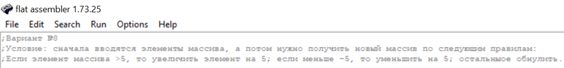

# H_ASS_ABC_2
Шкляр Михаил, ДЗ №2 по Архитектуре вычислительных систем, Вариант №8
## Программа для изменения элементов исходного массива
Условие:

Здесь описаны входные данные, необходимые для работы программы:

Далее, собственно, начало секции с кодом:

С помощью функций HeapCreate,HEAP_NO_SERIALIZE,HeapAlloc
мы сначала создаем heap API объект, запасаем некторое количество памяти в куче,
а именно N * 8 объектов, где N - длина первоначального массива.
В регистре eax будет адрес 1 зарезервированного элемента, который мы записываем
оттуда в [mas].
Заранее хотелось бы выделить 2 элемента: dword [eax] и cinvoke.
cinvoke - отличная альтернатива call, которая не трогает стек. 
Иногда нужно знать значение ячейки массива, например при погрузке в стек.
Как раз для этого и будем использовать dword [eax].
Мой код разделен на процедуры, поэтому далее буду описывать по ним.

В loop2 я считываю вводимые пользователем элементы в массив. Все циклы будут осуществляться с помощью
команды cmp и команды перехода jne: 

В loop3 + loop3cont я осуществляю "красивый" вывод массива в консоль:

В loop4 происходит главное действие. 
Сначала я получаю значения ячеек массива, записываю их в ebx, а потом
проверяю на условия получения нового массива (B) с помощью команд переходов 
jg, jl и jne. Далее меняю значение регистра ebx по ситуации:

В loop5 вывожу измененный массив на экран:

Далее идут подключенные библиотеки:

Теперь приведу примеры обычных результатов работы программы:

## Update
В начале программы было до бавлено условие задачи:

Кроме того, я разбил программу на процедуры, преднозначения которых следуют из 
названий, которые можно найти на скриншоте:

В качестве примера процедуры я привел последнюю, под названием Finish, в которой
происходит чистка памяти, зарезервированной под динамический массив.
На примере данной процедуры я также хотел показать, что необходимо изнчально пересылать
данные в "переменную" из регистра esp, являющийся указателем стека, 
а в конце процедуры обратно, ведь при вызове call в стек пушится адрес возврата,
после этого мы производим некоторые действия со стеком, но адрес возврата нужем нам сверху, 
чтобы его считал ret, осуществляющий выход из процедуры.

Привожу сделанные мной новые тесты программы.
1) Здесь я несколько раз ввожу слишком маленькие значения для длины массива(вектора), а потом 
запускаю с нормальным вариантом:

2) Здесь я ввожу слишком большое значение для длины массива(вектора), а потом 
запускаю с нормальным вариантом:

3) Здесь ввожу длину массива, равную 1, но, как видим, вывод получается в нужном формате и проблем
не возникает:

4) Здесь попробуем задать сликшом большие/маленькие значения для элементов массива.
Увидим, что ничего страшного не происходит, просто происходит переполнение:

## Update 2
Вначале менялся исходный массив с данными и выводился на экран. 
Теперь исходный массив А остается неизменным, а измененные данные добавляются в массив В.
В связи с этим по-другому выглядит место с основным кодом программы - откуда вызываются процедуры.
Добавлена процедура PrintSecondArray, т.к. макросами пользоваться нельзя, приходится писать разные функции для разных массивов:

Добавлено резервирование памяти под 2 массив:

PrintSecondArray:

## Источники
1) http://www.nestor.minsk.by/kg/2008/34/kg83402.html (простые массивы)
2) http://www.nestor.minsk.by/kg/2008/38/kg83805.html (динамические массивы)
3) https://blic.fandom.com/ru/wiki/Краткий_перечень_команд_ассемблера (команды)
